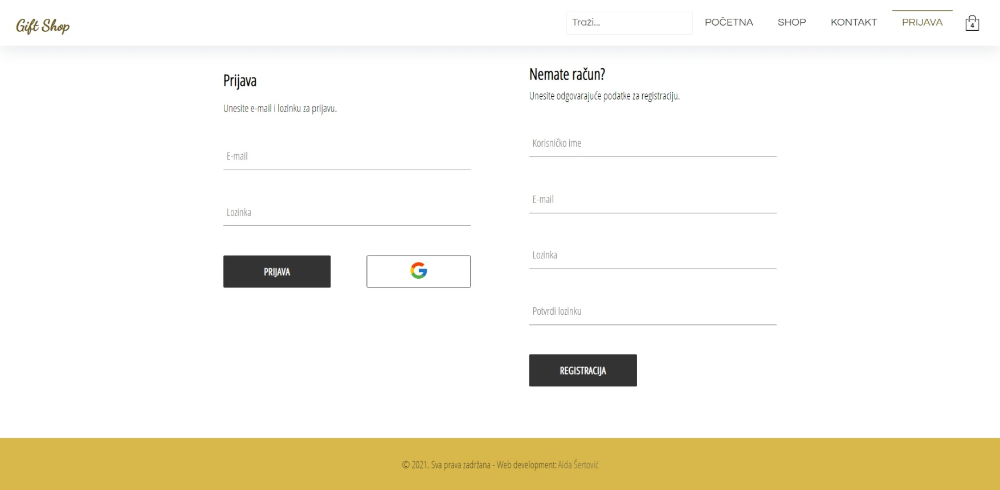

# E-commerce application

## Description

This project is a fully functional e-commerce application, featuring user authentification, wish list, cart, and payment. It is built with React.js and Redux on the front-end and Firebase on the back-end. It uses Stripe as a payment service.

**Tools and technologies:** HTML5, CSS3, JavaScript, ES6+, React.js, Redux, Firebase, Stripe.

## Screenshot

